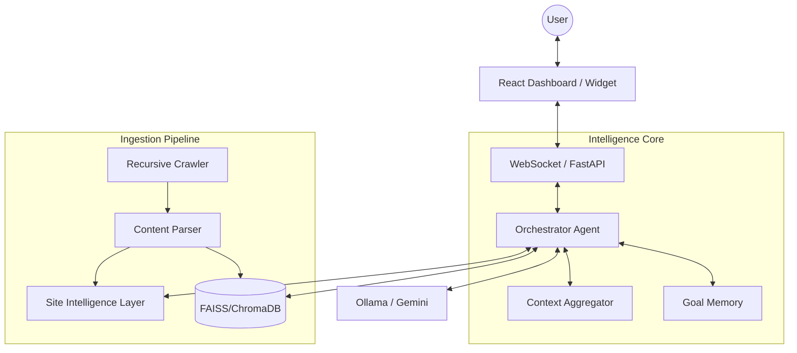

# TiO Architecture Overview

TiO is designed as a **Contextual Intelligence Platform** that bridges the gap between raw web data and proactive user assistance.

## 1. High-Level Architecture

## 2. Component Breakdown

### A. The Orchestrator (`orchestrator_agent.py`)
The brain of the system. It manages the conversation flow, detects intent, expands queries, and synthesizes the final response. It implements a multi-layer prompt strategy (Base → Domain → Skill → Mode → Goal → Context).

### B. Ingestion & Site Intelligence (`ingestion/service.py`, `utils/site_intelligence.py`)
When a website is connected, the crawler performs a recursive BFS traversal. Beyond raw text, it builds a **Site Profile** (Summary, Top Entities, Known Workflows, and Relationships).

### C. Contextual Synthesis Engine (`utils/context_intelligence.py`)
A specialized layer that processes raw retrieval chunks into a `ContextSnapshot`. This ensures the LLM receives "Atomic Facts" and "Workflows" rather than just paragraphs of text.

### D. Goal Persistence (`utils/goal_memory.py`)
TiO tracks the user's active goal and workflow stage (e.g., `Browsing`, `Evaluating`, `Booking`) across multiple turns. This enables proactive suggestions and workflow-aware retrieval.

## 3. Data Flow

1. **User Query**: Received via WebSocket or HTTP.
2. **Expansion**: Query is expanded based on detected domain and intent.
3. **Retrieval**: 
    - Pass 1: Semantic search in vector store.
    - Pass 2: (Optional) Boosted retrieval if a specific workflow is detected.
    - Pass 3: (Optional) External research via Tavily if local confidence is low.
4. **Synthesis**: Raw data is structured into a `ContextSnapshot`.
5. **Planning**: The Orchestrator generates a "Response Plan" (Goal, Workflow, Steps).
6. **Generation**: Final response is streamed to the user, grounded in the plan and snapshot.
7. **Tracking**: Latency, confidence, and hallucination flags are logged for audit.

## 4. Multi-Tenant Isolation
Every request is strictly scoped by `chatbot_id` and `user_id`. The vector store queries include hard metadata filters to prevent any possibility of cross-chatbot data leakage.
